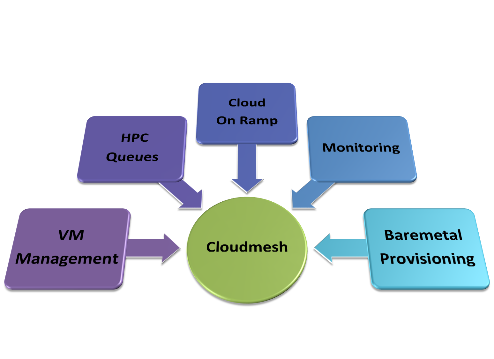
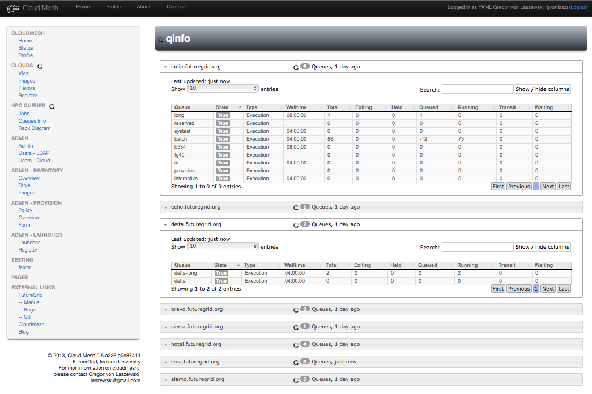

Home
======================================================================

Fetaures
----------------------------------------------------------------------

.. list-table:: 
   :widths: 30 60 10
   :header-rows: 1

   * - Feature
     - Description
     - Image
   * - Cloudmesh Core
     - A project to interface easily with multiple clouds from the command line and a command shell.
       `github <https://github.com/cloudmesh/cloudmesh>`_,
       `doc <http://cloudmesh.github.io/cloudmesh/>`_
     - |image-registry|
   * - Layered Extensible Architecture 
     -
     - |image-arch|
   * - Convenient Command Shell 
     -
     - |image-cmd3|
   * - Cloudmesh an On-ramp to Clouds 
     -
     - |image-onramp|
   * - Cloudmesh Metric for Clouds 
     -
     - |image-metric|
   * - Cloudmesh Inventory
     -
     - |image-inventory|
   * - Cloudmesh PaaS Launcher
     -
     - |image-launcher|
   * - Cloudmesh Federated VMs 
     -
     - |image-manage-vms|
   * - Cloudmesh HPC Queue Info
     -
     - |image-qinfo|
   * - Cloudmesh HPC Queue Stat
     -
     - |image-qstat|
   * - Cloudmesh Service Map
     -
     - |image-service-map| 
		 
		 
 
.. |image-arch| image:: _static/cloudmesh-arch-2013.png
   :width: 100px

.. |image-cmd3| image:: _static/cmd3.png
   :width: 100px

.. |image-metric| image:: _static/metric.png
   :width: 100px

.. |image-inventory| image:: _static/inventory.png
   :width: 100px

.. |image-launcher| image:: _static/launcher.png
   :width: 100px

.. |image-manage-vms| image:: _static/manage_vms.png
   :width: 100px

.. |image-qstat| image:: _static/qstat.png
   :width: 100px
.. |image-registry| image:: _static/cloud_register_openstack.png
   :width: 100px
.. |image-service-map| image:: _static/service_map.png
   :width: 100px

Cloudmesh
----------------------------------------------------------------------

.. toctree::
   :maxdepth: 1

   self
   cloudmesh
   projects
   cloud
   rain    
   hpc
   faq
   contact
   screenshots
   bib

