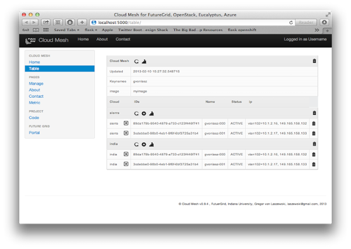
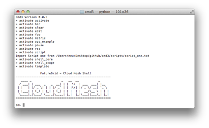

Projects
=======

We are working on a number of devellopment projects. Instead of just
providing a single project, we decided to split the development up in
some smaller subproject. This allows the groups to work independently
from each other and avoids the problem that a compile error in one
code causes an issue in another. All projects listed her are managed
in github.

.. list-table:: Projects
   :widths: 15 10 30 10
   :header-rows: 1

   * - Image
     - Project
     - Description
     - Source
   * - |image-arch|
     - Cloudmesh Core
     - A project to interface easily with multiple clouds from the command line and a command shell.
     - `github <https://github.com/cloudmesh/cloudmesh>`_,
       `doc <http://cloudmesh.github.io/cloudmesh/>`_
   * - |image-cmd3|
     - CMD3
     - A dynamic CMD shell with plugins, scripts, and variables and
       IEEE compliant man pages
     - `github <https://github.com/cloudmesh/cmd3>`_,
       `doc <http://cloudmesh.github.io/cmd3/>`_
   * - |image-rain|
     - Rain
     - A project to do bare metal and VM based dynamic provisioning for a HPC cluster, OpenStack, Eucalyptus.
     - `github <https://github.com/futuregrid/rain>`_
       `doc <http://futuregrid.github.io/rain/>`_
   * - 
     - Rain-Move
     - An extension to rain that allows to move resources between
       different IaaS, Bare metal, and HPC services.
     - `github <https://github.com/futuregrid/rain-move>`_,
       `doc <http://futuregrid.github.io/rain-move/>`_
   * - 
     - Teefaa
     - A project to dynamically provision operating systems.
     - `github <https://github.com/cloudmesh/teefaa>`_,
       `doc <http://cloudmesh.github.io/teefaa/>`_
   * - |image-metric|
     - Cloud-Metrics
     - A project to measure and display metric information about usage and utilization of your cloud.
     - `github <https://github.com/futuregrid/cloud-metrics>`_, 
       `doc <http://futuregrid.github.io/cloud-metrics/>`_
       `github <https://github.com/futuregrid/cloud-accounting>`_
       `Example <https://portal.futuregrid.org/doc/metric/index.html>`_
   * - |image-vcluster|
     - Virtual-Cluster
     - A project to create a SLURM based cluster in your cloud and run MPI jobs on it.
     - `github <https://github.com/futuregrid/virtual-cluster>`_, 
       `doc <http://futuregrid.github.io/virtual-cluster/>`_
   * - |image-portal|
     - Portal
     - A project to do develop a portal for the project
     - `www <http://portal.futuregrid.org/>`_
       `github <https://github.com/futuregrid/portal>`_

.. |image-arch| image:: images/cloudmesh-arch-2013.png       
   :width: 100px

.. |image-metric| image:: _static/metric.png
   :width: 100px

.. |image-vcluster| image:: _static/vcluster.png
   :width: 100px

.. |image-portal| image:: _static/portal.png
   :width: 100px

.. |image-github| image:: _static/github.png
   :width: 100px

.. |image-rain| image:: _static/rain.png
   :width: 100px
