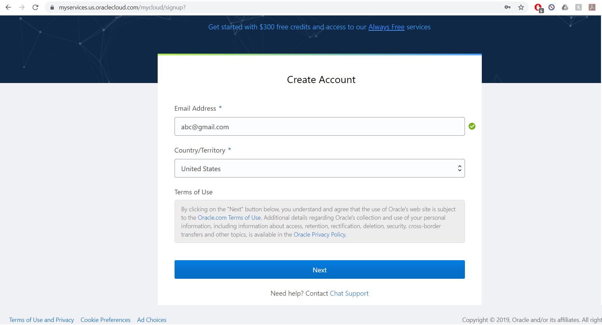
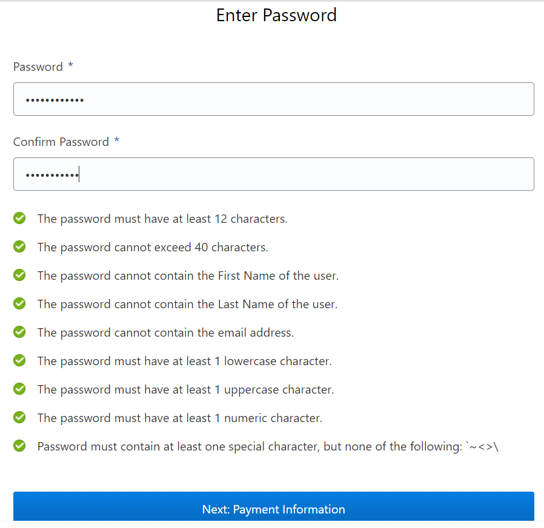
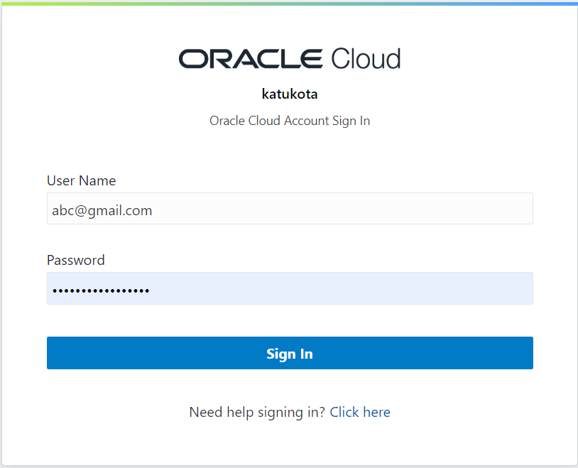
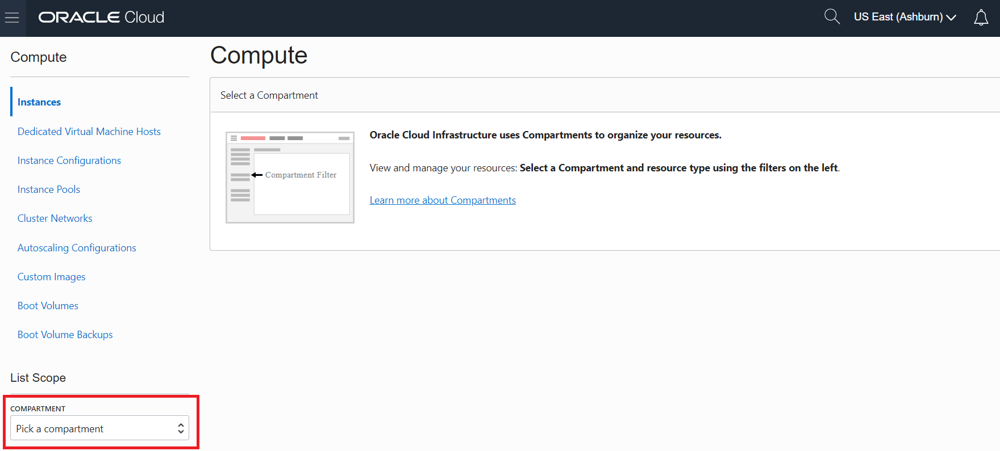
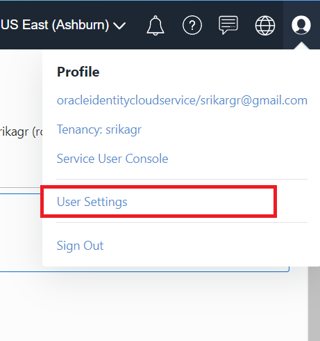
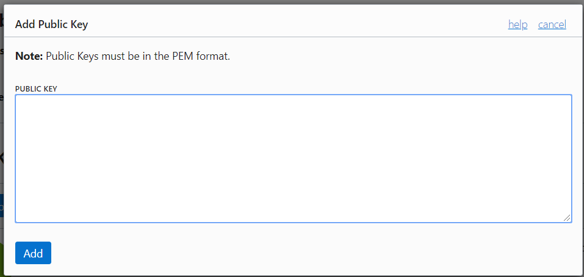
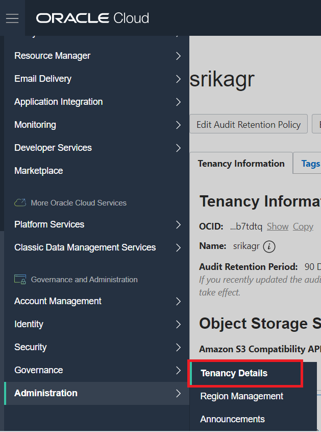
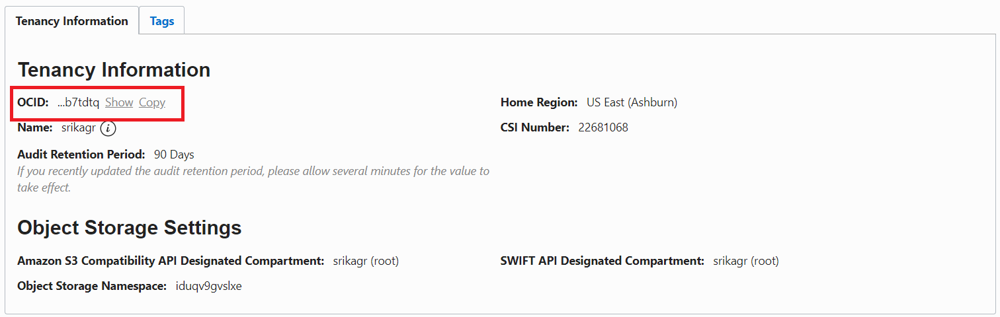

Oracle Cloud Account
====================

On 16th September 2019, Oracle announced a free tier. This allows
students and professionals to build, test, and deploy applications on
the Oracle cloud and database for free for an unlimited time. The free
tier though, has limits for various services. Two virtual machines and
two block volumes, and 10 GB each of object and archive storage is the
current limit for free cloud tier accounts.

.. figure:: images/free-tier-services.png
   :alt: Free Services

   Free Services

For cloudmesh, two services are important Oracle Cloud Compute Resources
and Oracle Storage.

Account Creation
----------------

Please follow the steps to create a new oracle cloud account and set up
the keys and values required for the cloudmesh config file.

Step 1: Go to the Oracle Cloud website to sign up for a free account.

https://myservices.us.oraclecloud.com/mycloud/signup?

Step 2: Fill out your email address and click on ``Next``.

   Create Account

Step 3: You will be directed to a page to enter your account details.
Select ``Account Type`` as ``Personal``. Fill out all the other fields
and click ``Next``.

.. figure:: images/account-details.png
   :alt: Acoount Details

   Acoount Details

Step 4: Verify you mobile number using the code that will be messaged to
you.

Step 5: Next, you will be asked to select a password. Please select one
and click ‘Next’.

   Password

Step 6: Fill out your payment information and proceed.

.. figure:: images/payment-information.png
   :alt: Payment

   Payment

Oracle has now created for you a free account with $300 credit for 30
days. After 30 days you can still use the ‘Always Free’ resources.
Unless you upgrade, your account will always be free.

.. figure:: images/trial.png
   :alt: Trial

   Trial

Account Login
-------------

To login to your account, follow the steps.

Step 1: Go to https://www.oracle.com/cloud/sign-in.html?. Enter the
cloud account name you used while registration and click ``Next``.

.. figure:: images/login.png
   :alt: Login

   Login

Step 2: Enter the email address and password you used for registration,
and click on ``Sign In``.

   Login-Next

Now you’ve successfully signed in to the Oracle Cloud.

You can click on the menu on the left to explore different oracle
services. When you try to access compute or storage services, you will
first need to select a compartment. A compartment is a logical container
to organize you resources. A default compartment with the same name as
your cloud name is created. It is easiest to select that compartment.

   Compartment

Oracle API
----------

To develop or run code related to oracle, its API called OCI (Oracle
Cloud Infrastructure) needs to be installed. To do this, run the command
using the command line.

.. code:: bash

   $ pip install oci

Cloudmesh Config File
---------------------

Cloudmesh config file (cloudmesh.yaml) will have the following entries
for compute and storage respectively. Add them to the config file if not
already there. 

Note: the image names are dated, and it is possible that this default image 
won't be available if you created your account recently. If so, you will need
to run ``cms image list --refresh`` to see available images and update the yaml files

Compute Entry
~~~~~~~~~~~~~

::

   cloudmesh:
     ...
     cloud:
       oracle:
         cm:
           active: true
           heading: ORACLE
           host: cloud.oracle.com
           label: oracle
           kind: oracle
           version: TBD
           service: compute
         default:
           image: Oracle-Linux-7.7-2020.03.23-0
           size: VM.Standard.E2.1
         credentials:
           user : TBD
           fingerprint : TBD
           key_file : ~/.oci/oci_api_key.pem
           pass_phrase : TBD
           tenancy : TBD
           compartment_id : TBD
           region : us-ashburn-1

Storage Entry
~~~~~~~~~~~~~

::

   cloudmesh:
     ...
     storage:
       oracle:
         cm:
           active: true
           heading: Oracle
           host: cloud.oracle.com
           label: oracle
           kind: oracle
           version: TBD
           service: storage
         default:
           directory: TBD
           bucket: home
         credentials:
           user : TBD
           fingerprint : TBD
           key_file : ~/.oci/oci_api_key.pem
           pass_phrase : TBD
           tenancy : TBD
           compartment_id : TBD
           region : us-ashburn-1

Required Keys and OCIDs
-----------------------

The keys marked as TBD in the config file needs to be filled in using
the values from your account. To do this, please follow the steps.

Create API Signing Key
~~~~~~~~~~~~~~~~~~~~~~

Run the following commands using command line.

Step 1: Create a directory ``.oci`` to store the credentials.

.. code:: bash

   $ mkdir ~/.oci

Step 2: Generate the key using the command:

.. code:: bash

   $ openssl genrsa -out ~/.oci/oci_api_key.pem -aes128 -passout stdin 2048

Step 3: You will then be prompted for a passphrase. Select a passphrase
and hit ``Enter``.

Step 4: To ensure that only you can read the key, run the following
command:

.. code:: bash

   $ chmod go-rwx ~/.oci/oci_api_key.pem

Step 5: Now, generate the public key and hit enter. You will again be
prompted for the passphrase. Please enter the passphrase created while
creating the private key and hit ``Enter``.

.. code:: bash

   $ openssl rsa -pubout -in ~/.oci/oci_api_key.pem \
                 -out ~/.oci/oci_api_key_public.pem \
                 -passin stdin

Step 6: Copy the contents of the public key to the clipboard as you will
require this.

Step 7: Add the passphrase to your config file ``cloudmesh.yaml`` under
oracle section.

:o2: you should have a program that does thsi for you such as

::

   cms register oracle [--dir=~/.oci]

User
~~~~

The value for ``user`` in the config file is the OCID of your user of
the oracle cloud account. You can find this using the following steps:

Step 1: Click on the profile menu on the right and click on
``User Settings``.

   User-Details

Step 2: The user OCID can be found under ``User Information``. Copy and
paste it to the config file.

.. figure:: images/user.png
   :alt: User

   User

Step 3: Go to the end of web page and click on ``Add Public Key`` under
``API Keys``.

.. figure:: images/public-key.png
   :alt: Public Key

   Public Key

Step 4: Paste the contents of the public key
``~/.oci/oci_api_key_public.pem`` to the text-box in the pop-up and
click ``Add``.

   Add Public Key

Step 5: A new key will be added to the API Keys. Copy the
``Fingerprint`` of the key and paste it in the config file.

Tenancy
~~~~~~~

The value for ``tenancy`` in the config file is the OCID of your tenancy
account. You can find this using the following steps:

Step 1: Click on the navigation menu on the left, go to
``Administration`` and click on ``Tenancy Details``.

   Tenancy

Step 2: The tenancy OCID can be found under ``Tenancy Information``.
Copy and paste it to the config file.

   Tenancy Details

Compartment
~~~~~~~~~~~

The value for ``compartment`` in the config file is the OCID of your
selected compartment. You can find this using the following steps:

Step 1: Click on the navigation menu on the left, go to ``Identity`` and
click on ``Compartments``.

.. figure:: images/identity.png
   :alt: Identity

   Identity

Step 2: Select your root compartment from the compartment list.

.. figure:: images/select-compartment.png
   :alt: Select Compartment

   Select Compartment

Step 3: The compartment OCID can be found under
``Compartment Information``. Copy and paste it to the config file.

.. figure:: images/compartment-details.png
   :alt: Compartment Details

   Compartment Details

Public Key
~~~~~~~~~~

Add the path to the ssh public key in the cloudmesh.yaml file in
cloudmesh /profile/publickey.

Compute Service
---------------

The first thing we need to make sure is that a private public ssh key
pair has been set up in the default directory ``~\.ssh\id_rsa.pub``.
This key will be used to login into the virtual machine instances
created by us.

To set the cloud to oracle, use the command:

.. code:: bash

   $ cms set cloud=oracle

To create a new instance on oracle cloud, use the command:

.. code:: bash

   $ cms vm boot

To login into the instance, use the command:

.. code:: bash

   $ cms vm ssh

To stop the instance, use the command:

.. code:: bash

   $ cms vm stop 'vm-name'

To terminate the instance, use the command:

.. code:: bash

   $ cms vm terminate 'vm-name'

Storage Service
---------------

The first time you try to access storage services, it wil be empty and
any operation to ``list/get/delete`` will result in an error. Hence, to
start first ``put`` a new file on the cloud. This will result in
creation of a new bucket with the name specified in ``cloudmesh.yaml``.

``create dir`` command to create a directory on the cloud object storage
system is not supported in Oracle. Only when uploading a file can a
directory structure be created. IF all the files in the directory are
deleted, the directory is deleted too.

To upload a new file/directory to the cloud, use the command:

.. code:: bash

   $ cms storage --storage=oracle put SOURCE DESTINATION

To download a file from the cloud, use the command:

.. code:: bash

   $ cms storage --storage=oracle get SOURCE DESTINATION

To list all the files from the bucket/directory, use the command:

.. code:: bash

   $ cms storage --storage=oracle list SOURCE

To delete a file/directory from the cloud, use the command:

.. code:: bash

   $ cms storage --storage=oracle delete SOURCE

Note that if a directory is deleted, all the files inside the directory
are also deleted.

To search a file in a particular directory, use the command:

.. code:: bash

   $ cms storage --storage=oracle search DIRECTORY FILENAME

References
----------

-  OCI Documentation,
   <https://oracle-cloud-infrastructure-python-sdk.readthedocs.io/en/latest
   /index.html>
-  Required Keys and OCIDs,
   https://docs.cloud.oracle.com/iaas/Content/API/Concepts/apisigningkey.htm
