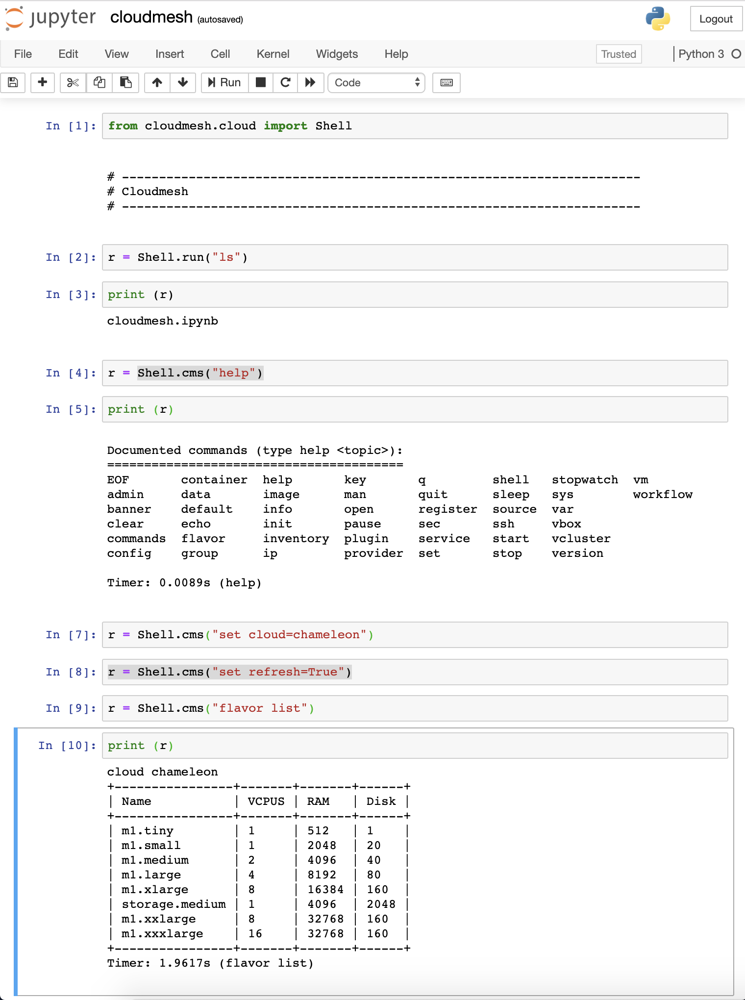

Jupyter Integration
===================

To install jupyter please use:

.. code:: bash

   pip install jupyter

To start a notebuk use the regular jupyter command

.. code:: bash

   jupyter notebook

Now select under `new` the name of the notbook you like to create, and make
sure you use python 3. As cloudmesh provides an API it is very easy to
integrate it into jupyter. The following image shows how easy it is

However, naturally we can also use build in fetuares of jupyter such as
running shell commands with

.. code:: bash

   [1] !cms set cloud=AWS
   [2] !cms vm star

API calls
---------

To use the specific API calls, We recommend you to look at the API
documentation of cloudmesh. To show you a simple example of advanced
functionality we demonstarte how to list flavors of a cloud:

.. code:: ipython3

    from cloudmesh.compute.vm.Provider import Provider
    provider = Provider(name="chameleon")

.. code:: ipython3

    flavors = provider.flavors()
    flavors[0]['name']

.. parsed-literal::

    'm1.tiny'

.. code:: ipython3

    provider.Print(flavors)

.. parsed-literal::

    +----------------+-------+-------+------+
    | Name           | VCPUS | RAM   | Disk |
    +----------------+-------+-------+------+
    | m1.tiny        | 1     | 512   | 1    |
    | m1.small       | 1     | 2048  | 20   |
    | m1.medium      | 2     | 4096  | 40   |
    | m1.large       | 4     | 8192  | 80   |
    | m1.xlarge      | 8     | 16384 | 160  |
    | storage.medium | 1     | 4096  | 2048 |
    | m1.xxlarge     | 8     | 32768 | 160  |
    | m1.xxxlarge    | 16    | 32768 | 160  |
    +----------------+-------+-------+------+

