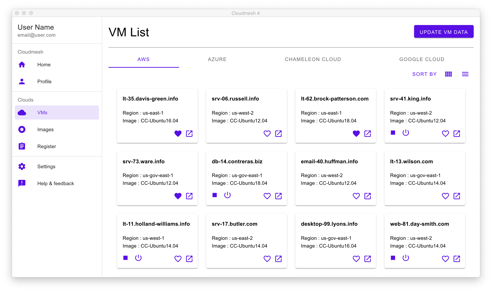

Cloudmesh Graphical User Interface
==================================

-  This project can also be taken as independent study or as part of the
   Cloud Engineering class

Goals
-----

In this project you will be developing a graphical user interface for
cloudmesh based on Electron. You will be focusing on first displaying
the information available in the cloudmesh database. This includes,
information from clouds about

-  images
-  flavors
-  virtual machines
-  keys
-  security groups

You will also develop a convenient registration form that dynamically
creates a form for including credentials from the various clouds based
on the cloudmesh configuration file. For

-  virtual machines
-  keys
-  security groups

uploading new information including starting new vms is required. The
clouds we consider are

-  openstack
-  AWS
-  Azure
-  Google

Requirements
------------

This project is easy for those with javascript experience. We will not
consider other GUI frameworks. If you however find a better one, please
discuss with us first.

Difficulty
----------

*easy - moderate:* This is an easy project as in theory you will only
need minimal access to the cloud while making sure you obtain
information for each of the data types, which can either be obtained
from cloudmesh or can be found in the code base where examples are
posted.

Deliverables
------------

-  Working code
-  Video documenting the use of the GUI

   -  showcasing image, flavor, and vm interactions
   -  showcasing registration for clouds

-  checkins into github by all team members. If only one team member
   checks in all other team members will not get credit.

References
----------

-  `Github
   Issue <https://github.com/cloudmesh/cloudmesh-cloud/issues/201>`__

A previous code is available in

-  `Github <https://github.com/cloudmesh-community/graphql>`__

However this code uses Graphql, we like to convert it to use MongoDB and
improve. A sample image of the dashboard is shown next

   Dashboard

More images can be found in the
`README <https://github.com/cloudmesh-community/graphql/blob/master/README.md>`__
