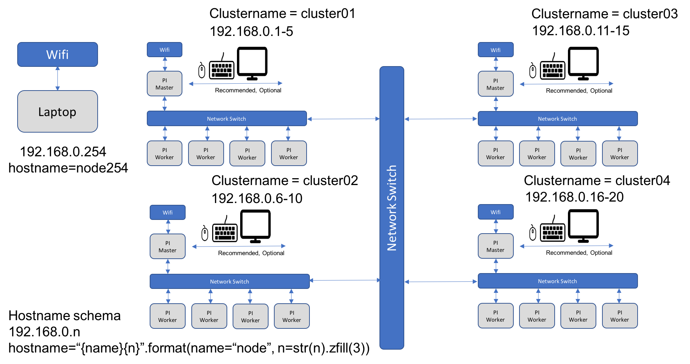

Cloudmesh Raspberry Cloud Clusters
==================================

-  This project can also be taken as independent study or as part of the
   Cloud Engineering class.
-  If an online student (not living in Bloomington) like to do this
   project, they do have to purcahse at minimum 3 Rasberry Pi’s. As well
   as a network hub.
-  Residential students will have access to 100+ Raspberry Pi’s to build
   a cluster. They can for the duration of the class obtain 10 Pi’s and
   2 network hubs in a non-smoker environment.
-  This is an ideal project for those that like to build their own cloud
   cluster
-  Residential students will need to focus on building a multi cluster
   environment.
-  This project may be a preriquisite to other Pi projects.

Goals
-----

In this project you will be further developping and using the cloudmesh
``cm-burn`` command to create SD cards with network and host information
to create a cluster from raspberry Pi’s.

In fact residential students will build multiple such clusters. We will
install sshd and docker on the clusters. In the project you can also
experiment with deploying kubernetes.

You will be testing the cm burn code and improve if improvements are
needed. You will be documenting how to create the cluster and set up the
network.

You will be showcasing the cluster(s) using ssh and container
applications.

Requirements
------------

Basic knowledge of python or a programming language as all programming
is done in python. Python is easy to learn. Access to at least 3
Raspberry Pi’s. Minimal knowledge of networking is required, which
however can be obtained during the project.

-  This project must report on weekly basis.

Difficulty
----------

*easy*: For a single cluster this project is easy as mauch of the work
has been done. However, network specifications need to be explored.

*moderate*: For a multicluster environment some more work is needed and
networking configurations have to be identified.

Deliverables
------------

-  Update to the newest Raspbian
-  Working command to set up the cluster.
-  Manual on how to do the setup.
-  checkins into github by all team members. If only one team member
   checks in all other team members will not get credit.
-  Collaborate with *all* teams that do this project so we can get
   benchmarks for all clouds and compare the results not only within
   your team, but all teams.

Resources
---------

-  `Github <https://github.com/cloudmesh-community/cm-burn>`__

An image what cm burn does and how it works is available
`here <https://github.com/cloudmesh-community/cm-burn/blob/master/README.md>`__.

A single cluster is shown in the next Figure

.. figure:: images/network.png
   :alt: Network Example

   Network Example

A cluster of cluster is shown in the next figure. Residential students
have 100 Pis and many network switches to build such an environment.

   Network Cluster of Clusters Example
