Google Drive
============

Google Drive is a file storing platform where an user can store all
his/her files in the google drive.  You will need Google Drive to
work with Cloudmesh Storage to store files in Google Drive. 
Here files can be of any form
ranging from documents to audio, video or image files. In free account
each user will be given around 15 GB of free data space to be
stored. We can create folders and subfolders in the Google Drive to
store our data.

Each file will be stored in Google cloud with a unique URL and it’s up
to the user to make the file sharable or not.  Google Drive is
reliable and if an user has different devices and if he/she wants to
access those files then Google Drive is needed in this case as he can
have access to his file as all his files are stored in the cloud.  The
user does not need to install any kind of software in order to view
these files.

Create a Project
----------------

Do obtain credentials to use Google drive, go to `Google APIs
<https://console.developers.google.com/>`_ website and create a
project.  To create a project, go to Dashboard in Google APIs
console. In the **Select a Project** window, click **NEW PROJECT**.

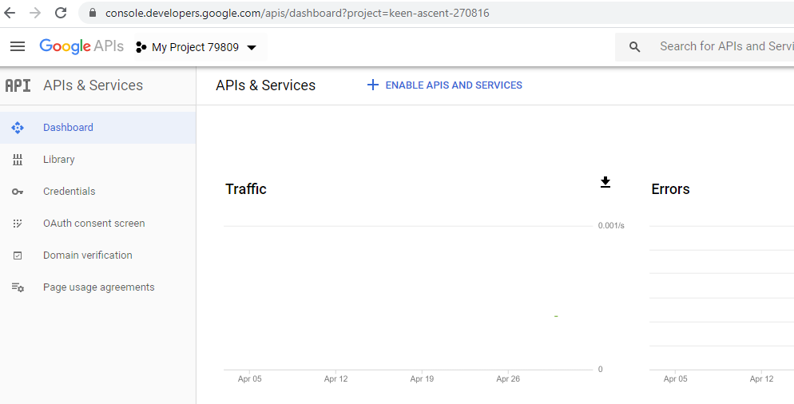

   
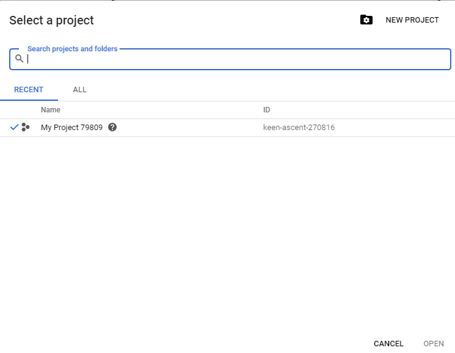

Enter a project name we want to use.  Click **CREATE**.

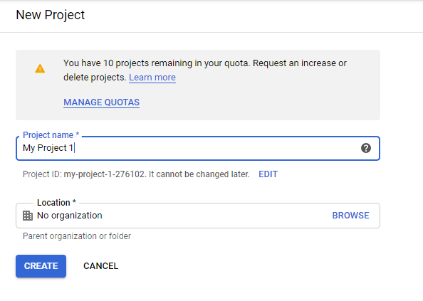

Enable APIs and Services
------------------------

In the APIs and Services Dashboard for the project we created, click
**ENABLE APIS AND SERVICES**.

.. figure:: images/4enable_apis.PNG
   :alt: Enable APIs and Services

This leads to the **Welcome to the API Library** page.  

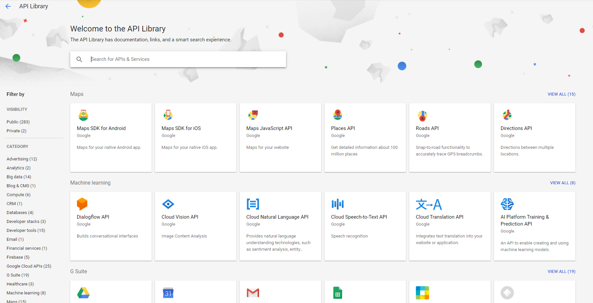

Search for "google drive api".

.. figure:: images/6google_drive_api.PNG
   :alt: Google Drive API

Click **ENABLE**.

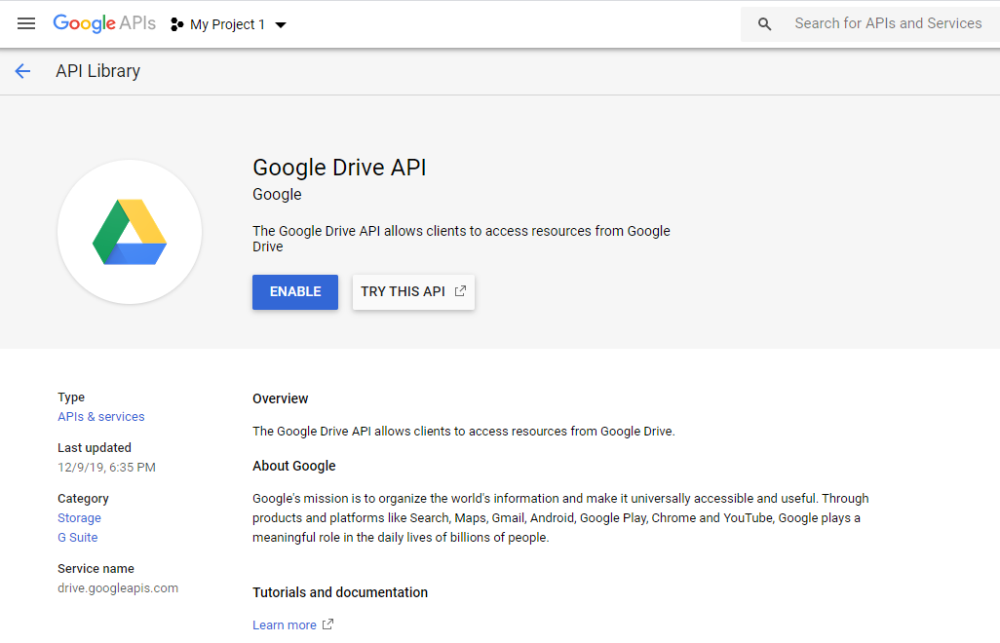

Create Credentials
------------------

At the Google Drive API Overview page, click **CREATE CREDENTIALS**.

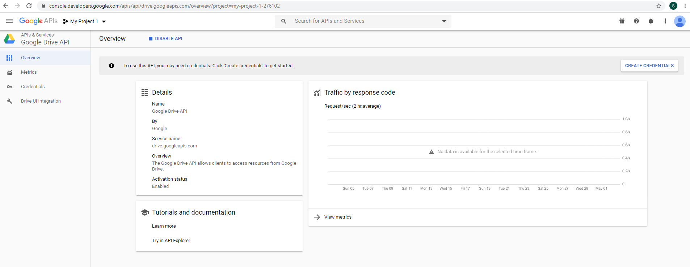

Select the credentials you need.  Click **What credentials do I need?**.

.. figure:: images/9add_credentials.PNG
   :alt: What credential do I need?

At the **Set up OAuth consent screen**, click **SET UP CONSENT SCREEN**.

.. figure:: images/10set_up_oauth.PNG
   :alt: Set up Consent Screen

Select **External** user type.  Click **CREATE**.

.. figure:: images/11oauth_consent.PNG
   :alt: Oauth consent screen

Enter application name.  Enter the gmail account we use for the project.

.. figure:: images/12oauth2.png
   :alt: Oauth consent screen - continued

Select scopes to **See, edit, create, and delete all of your Google
Drive files**, and **See and download all your Google Drive files**.
Click **ADD**.

.. figure:: images/13add_scope.PNG
   :alt: Add scope

Click **Save**.

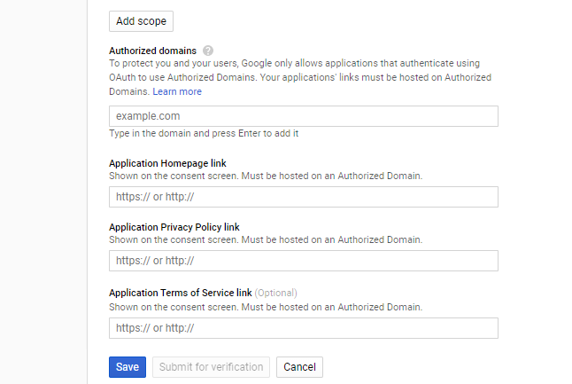

At the APIs and Services Credentials page, click **CREATE CREDENTIALS**,
select **OAUTH client ID**.

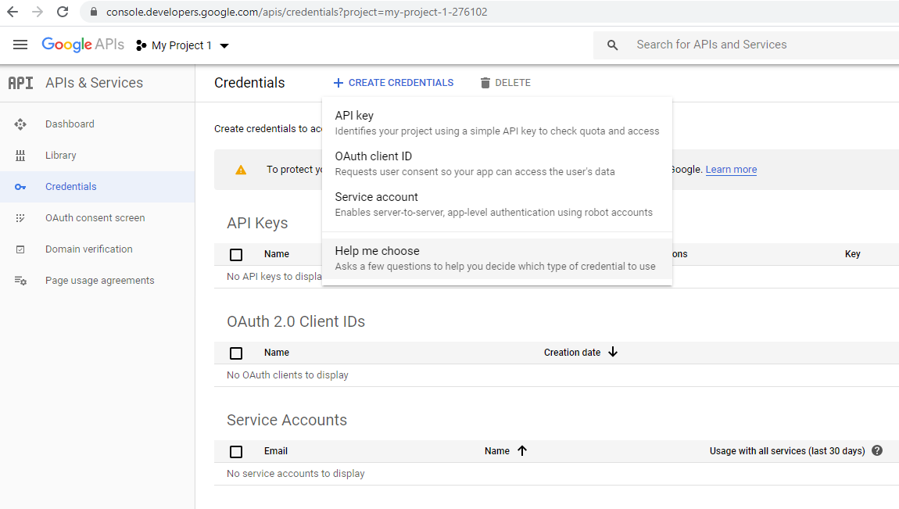
   
Select **Other** for application type.  A default name "Other client
1" will be generated which we can keep.

.. figure:: images/16create_oauth.PNG
   :alt: Create OAuthclient ID

This leads to **OAuth client created** screen.  Click **OK**.

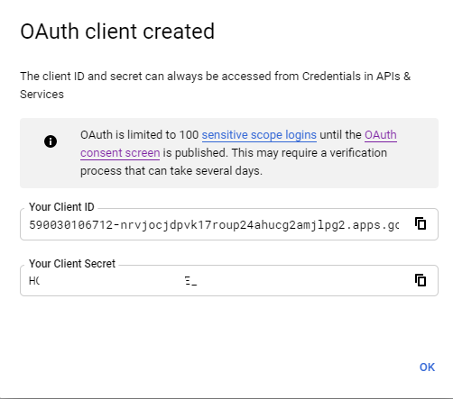

Click the download button to download the credential file.

.. figure:: images/18download.PNG
   :alt: Download client secret file

The default name of the file is something like
"client_secret_xxxxxxxxxxxxxxxxxxxxxxxxxxpg2.apps.googleusercontent.com.json".
Rename it to "credentials.json", and place it in the directory
specified in cloudmesh.yaml for key "credentials_json_path".

Authorization Flow
------------------

In order to create the authorization flow, we also need to modify
cloudmesh.yaml to store the paths of the files needed for
authentication, including path for `credentials.json` and path for
`token.pickle`, which we will create next.  ::

    parallelgdrive:
      cm:
        active: false
        heading: GDrive
        host: dgrive.google.com
        label: parallelgdrive
        kind: parallelgdrive
        version: TBD
        service: storage
      default:
        directory: TBD
      credentials:
        credentials_json_path: [put the path of credentials.json here]
        token_path: [put the path of token.pickle here]

Now we are ready to create the authorization flow.  The codes for
creating credentials for authorization is included in the Provider.py
file. Here is the link:

`Provider.py <https://github.com/cloudmesh/cloudmesh-storage/blob/master/cloudmesh/storage/provider/parallelgdrive/Provider.py/>`_  

When we run the Provider.py for the first time, do so in the Terminal.

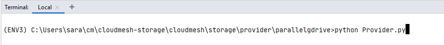

We will be redirected to the Sign in page.  Choose the Google account
to continue to the project.

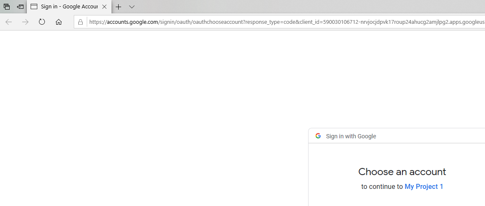
   
Click **Advanced**.

.. figure:: images/21advanced.PNG
   :alt: Advanced

Click **Go to [your project name]**.

.. figure:: images/22go_to.PNG
   :alt: Go to project

In the Grant permission page, click **Allow**.

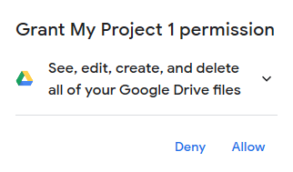

Click **Allow** again to confirm.

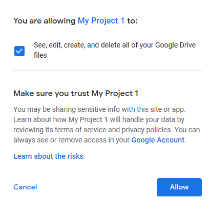

Message will be displayed that the authentication flow has been completed.

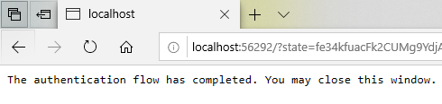

When the authentication flow completes, it will create a
``token.pickle`` file in our working directory on our computer.  We
need to place this file in the token_path specified in the
`cloudmesh.yaml` file.

This file can be used for future purposes so we do not need to login
everytime. If we delete this file for any reason, e.g. changing the
permission scope, then the authorization process will again ask for
login id and password, and again create ``token.pickle``
automatically.
