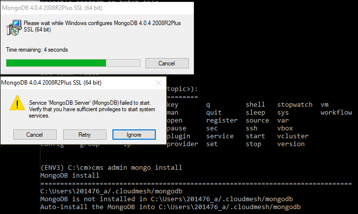
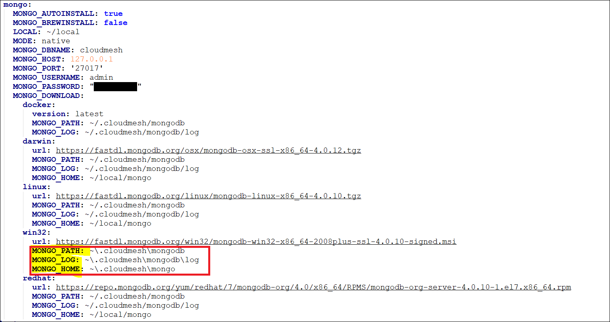
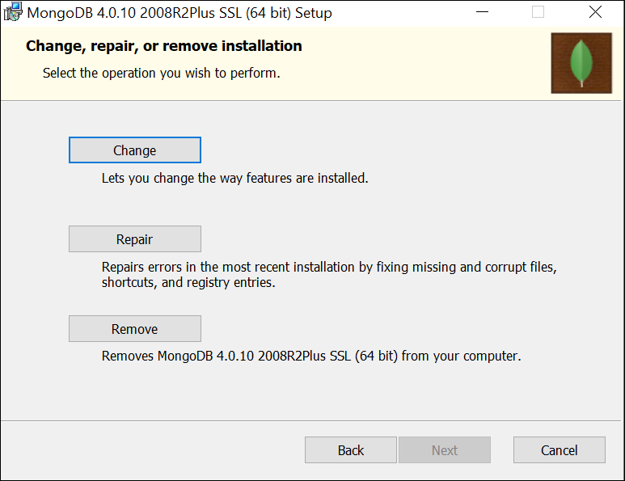

Cloudmesh Database
==================

Cloudmesh stores its status in a database so that you can easily
remember which services you used where and have an accurate account of
them. We use as a database mongoDB to store this information. To use
cloudmesh you simply need to create and start the database service.

We install a separate version of mongo in your `~/.cloudmesh` directory. Use the command::

    cms admin mongo install

On windows you need to do this very carefully as there is one installation
box that you need to ignore to make this possible.

First you need to change the password for mongo in the ``cloudmesh.yaml`` file
Now you can create an empty database with

you can initialize it with

.. code:: bash

    cms gui quick
    cms init

MongoDB Installation Steps
--------------------------

The following steps document the MongoDB server configuration and
installation steps from the standpoint of a fresh install. We
recommend utilizing our build script for a seamless installation
experience.  However, If you already have a pre-existing installation
of MongoDB, please feel free to skip ahead once you've reviewed the
configuration steps and confirmed you have an admin user with a strong
password created. Please also note that some commands we use during
the development wipe out the database completely including all
collections. So make a backup.

If you would like to remove an existing MongoDB installation, please
skip to the next subsection in order to reference the uninstall steps
for MongoDB; then revert back to this section to kick off a fresh
install.

You should also note to *not* expose mongo on the internet in order
to keep your information within mongo private.

Prior to starting the MongoDB installation, you will need to install and
configure the ``cloudmesh.yaml`` file if you have not already done so.
To install it, run the following command:

.. code-block:: bash

   cms help

Then, be sure to edit the cloudmesh.yaml configuration file (which is created
under ``~/.cloudmesh`` directory) and update the parameters values used in the
mongo install. You can use a text editor, such as:

.. code-block:: bash

   emacs ~/.cloudmesh/cloudmesh.yaml

and change the password of the mongo entry to something of your choosing.
Note, be sure to use a very strong password credential::

   MONGO_PASSWORD: TBD

In case you do not have mongod installed, you can do so for macOS and Ubuntu
18.xx by setting the following variable::

   MONGO_AUTOINSTALL: True

Alternatively you can set these cloudmesh.yaml parameter values from the
command line  without using an editor by running the following:

.. code-block:: bash

   cms config set cloudmesh.data.mongo.MONGO_AUTOINSTALL=True
   cms config set cloudmesh.data.mongo.MONGO_PASSWORD=YOURPASSWORD

Another item to note is the default location of the MongoDB installation.
In a Linux/MacOS environment, the default installation path will be under
``~/local/mongo/bin``. In a Windows environment, the default path is under
``C:\Users\USERNAME\.cloudmesh\mongo``. If you would like to change these
paths, be sure to update these in the `cloudmesh.yaml` file.

Once configuration of the `cloudmesh.yaml` file has been completed,  run the
following command (assuming you have the user in the c drive), where USERNAME
is the username you installe d cloudmesh in:

.. code-block:: bash

  C:/Users/USERNAME\ENV3\Scripts\activate
  cms admin mongo install

.. note:: In a Windows installation, we are only required to install
          MongoDB commands, *not* MongoDB Service. By default, the
          silent installer will attempt to install and start the
          MongoDB System Service. When prompted that the Service
          failed to start, simply select ``Ignore``.

     Figure: Mongo Windows install. Make sure to press ignore

After the installation completes, in a Linux/MacOS environment, confirm the
MongoDB installation path was added to the ``.bash_*`` file. This should have
already been done automatically if the ``cms admin mongo install`` command
was used to kick off the installation.

In a Windows environment, however, the default path is not automatically added
to the Path variable, so you will need to add this manually:

.. figure:: ../images/MongoInstall_Windows_Path.png
     :width: 600px
     :align: center
     :alt: alternate text
     :figclass: align-center

     Figure: Mongo Windows path configuration

Now that MongoDB has been installed, we initialize it with the following
command:

.. code-block:: bash

    cms init

In case you like to stop or start is you can say:

.. code-block:: bash

   cms stop
   cms start

Please remember that for cloudmesh to work properly you need to start
mongo. In case you need a different port you can configure that in the yaml
file.

Uninstall of MongoDB on Windows 10
----------------------------------

This section documents  steps required to uninstall MongoDB from a prior installation

Note that there are two distinct uninstallation steps to consider. If you have
installed MongoDB using the cloudmesh installer
(i.e. ``cms admin mongo install``), Mongo is not installed with a service by
default, and can be simply uninstalled by removing the install directories
under ``~\.cloudmesh`` (reference the MONGO_PATH, MONGO_LOG, and MONGO_HOME
variables within the cloudmesh.yaml file for specifics).

If, however, you have a pre-existing installation of MongoDB, or
have MongoDB Server Service installed through an alternative installation method
outside of cloudmesh, proceed through the following steps if you wish to
completely uninstall MongoDB.

To uninstall, please terminate the running MongoDB service (if
applicable), *then* delete it. To stop the service, open Task Manager
and confirm the status = `Stopped`. If it is not stopped, please do
so. To delete it, run the following as an administrator from the
command line:

.. code-block:: bash

   sc.exe delete MongoDB

Next, delete the Mongo installation directories. Please reference the
cloudmesh.yaml file for the MONGO_HOME, MONGO_PATH, and MONGO_LOG path values if
``cms admin mongo install`` was attempted at some point.

     Figure: Mongo install path

Finally, execute the mongodb `msiexe` installer to check if there are
any remaining components that need to be uninstalled. Once launched,
click on the `Remove` button. Note that this installer can be
downloaded locally using the URL found under the MONGO_DOWNLOAD
variable in the cloudmesh.yaml file.

     Figure: Mongo installation

.. note:: If Compass was installed, this can simply be removed by
          navigating to the Windows 'Add Remove Programs'.

You have now successfully removed MongoDB, and are ready to reinstall
a fresh instance.
