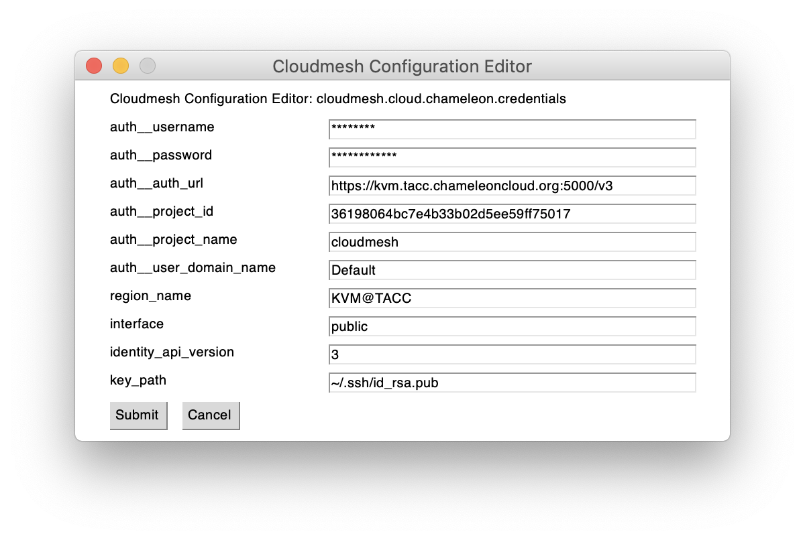

Quickstart
==========

This quickstart assumes you have already performed the following

* installed cloudmesh
* installed mongodb either with the help of cloudmesh or another method

One of the features up Cloudmesh is to easily start new virtual machines
on various clouds. It uses defaults for these clouds that can be changed,
but are easily stored in a yaml file located at
``~/.cloudmesh/cloudmesh.yaml`` This file is created upon first start
of the shell. You need to edit it and include some of your cloud
information.

A template for the yaml file is located at:

-  https://github.com/cloudmesh/cloudmesh-cloud/blob/master/cloudmesh/etc/cloudmesh.yaml

Make sure that if you edited the yaml file that you check if it is correctly
formated. This can be done with

.. code:: bash

   cms config check

Configuration with the GUI
--------------------------

Cloudmesh comes with a simple GUI program that can only be used on the machines
natively. E.g. It does not work in containers and the Linux Subsystem on
Windows.

To install it as user you can do it with::

    pip install cloudmesh-gui

You will have the command `cms gui` available. You will need to configure the
profile, activate clouds, and add credentials for a cloud. For this you can
use::

    cms gui quick
    cms gui profile
    cms gui activate
    cms gui cloud chameleon
    cms gui mongo user

We assume here you like to configure the credentials for the chameleon cloud.

.. figure:: ../images/profile.png
   :width: 600px
   :align: center
   :alt: alternate text
   :figclass: align-center

   Figure: Setting the profile `cms gui profile`

.. figure:: ../images/activate.png
   :width: 600px
   :align: center
   :alt: alternate text
   :figclass: align-center

   Figure: Activate clouds `cms gui activate`

   Figure: Update credentials `cms gui cloud chameleon`

Manual
------

Before we start it is important to note that cloudmesh provides a quick way
to look at its documentation with

.. code:: bash

   cms open doc

Generating the Key and Certificate
----------------------------------

If you do not have yet generated an ssh key you will have to do it now.
First, you need to create a public-private key with a passphrase. This
can be achieved with the following command

.. code:: bash

   cms config ssh keygen

Alternatively you can create a key as follows

.. code:: bash

   ssh-keygen -t rsa -m pem

In case you already have a key, that is not in pem format, you can convert it
with

.. code:: bash

   openssl rsa -in ~/.ssh/id_rsa -out ~/.ssh/id_rsa.pem

Validate and verify the key
---------------------------

To validate the key please use the cms commands

.. code:: bash

   cms config ssh check
   cms config ssh verify

Initialization
--------------

To initialize cloudmesh and its database the easiest way is
calling the commands::

   cms init

Note that the init command also starts the mongodb. This needs to be done
only one time. Form now on you can start and stop cloudmesh with::

   cms start

We recommend that after you are done working with cloudmesh to stop it with::

   cms stop

Initialize keys and Security Groups
-----------------------------------

.. code:: bash

   cms set cloud=chameleon
   cms sec load
   cms sec group load default --cloud=chameleon
   cms key upload --cloud=chameleon

Command line
------------

After you started cms you can issue a number of commands. The benefit of
cloudmesh is that it is easy to switch between clouds with the set command.
After the set and specifying the cloud by name many commands will default to
that cloud. The exception is the ``vm list`` command that lists by default
all vms on all clouds. In addition the ``vm refresh`` command will also
work on all clouds.

.. code:: bash

   cms start

   cms set cloud=chameleon
   cms set refresh=True

   cms vm boot
   cms image list
   cms flavor list

   cms set cloud=aws
   cms vm boot
   cms image list
   cms flavor list

   cms set cloud=azure
   cms vm boot
   cms image list
   cms flavor list

   cms set cloud=jetstream
   cms vm boot
   cms image list
   cms flavor list

   cms set cloud=vagrant
   cms vm boot
   cms image list
   cms flavor list

   cms vm refresh
   cms vm list

   cms stop

In case you want a command explicitly apply to one or more clouds or one
or more vms, they can be specified by name such as

.. code:: bash

   cms vm list --name vm[0-100]
   cms vm list --cloud aws,azure

Defaults for the cloud and the name can be specified through set such as

.. code:: bash

   cms set name=vm[0-100]
   cms set cloud=aws,azure

.. todo:: check if multiple clouds can be set and the list command works on
          multiple clouds. Check this also for image and flavor commands

Using the commands

.. code:: bash

   cms vm list

would than add the appropriate options to the command. To reset the show
to all vms set name and cloud to all

.. code:: bash

   cms set name=all
   cms set cloud=all

Interactive shell
-----------------

Cloudmesh uses cmd5 for its shell implementation and thus all commands
that are typed in in the terminal can also be typed in into a shell that
is started with cms

.. code:: bash

   cms
   cms> set cloud=aws
   cms> vm boot

Command scripts
---------------

As we use cmd5 we also have access to piped and named scripts with

.. code:: bash

   echo script.cms | cms

and

.. code:: bash

   cms --script script.cms

Cache
-----

All information about for example virtual machines are cached locally.
The cache for various information sources can be explicitly updated with
the ``--refresh`` flag. Thus the command

.. code:: bash

   cms vm list --refresh
   cma flavor list --refresh
   cma image list --refresh

would first execute a refresh while the command

.. code:: bash

   cms vm list
   cms flavor list
   cms image list

would only read from the local cache. To change the behavior and always do a
refresh from the cloud you can use the command

.. code:: bash

   cms set refresh=True

To switch it off you can say

.. code:: bash

   cms set refresh=False

Using quotes
------------

.. warning:: In case you need to use quotes in the command line you need to
             mask them with a bakslash on Linux and macOS and with 3 quotes in Windows,
             as this is a feature of your shell.

Thus you would use

.. code:: bash

   cms vm list --cloud=\"chameleon\"

However as there are no quotes needed in the provious command it can simply
be written as

   cms vm list --cloud=chameleon

There are two exceptions that we implemented on Linux and macOS. Here the commands

.. code:: bash

   cms set x="variable with spaces"
   cms config set x="variable with spaces"

Will also work, e.g. the backslash is not needed.

However, on windows you need to use the three quotes such as

   cms set x="""variable with spaces"""

Configuring chameleon cloud
---------------------------

In many of the classes we teach you will have access to chameleon cloud. You
will get a cloudmesh.yaml file as part of the class in which you only need
to set your username and your password. This is done on the terminal with

.. code:: bash

   cms config set cloudmesh.cloud.chameleon.credentials.OS_USERNAME=YOURUSERNAME
   cms config set cloudmesh.cloud.chameleon.credentials.OS_PASSWORD=YOURPASSWORD

Where YOURUSERNAME, and YOURPASSWORD is the account name and password from
the account giving you access to

* https://www.chameleoncloud.org/

Thus if you have an account and are part of the class project, you can gain
access to an openstack cloud in seconds via cloudmesh.

Timer
-----

Cloudmesh has the ability to print the time it takes to execute a command. You
can switch it on with

.. code:: bash

   cms set timer=true

Debugging
---------

Cloudmesh has some debugging features build in. To switch them on or of please
use the commands

.. code:: bash

   cms debug on
   cms debug on

In case of `on` the following values are set:

.. code:: bash

   cms set debug=True
   cms set trace=True
   cms set verbose=10
   cms set timer=True

After setting them additional debug messages witl be printed.

In case of `off` the following values are set:

.. code:: bash

   cms set debug=False
   cms set trace=False
   cms set verbose=0
   cms set timer=True

These values can also be individually controlled with the set command.

