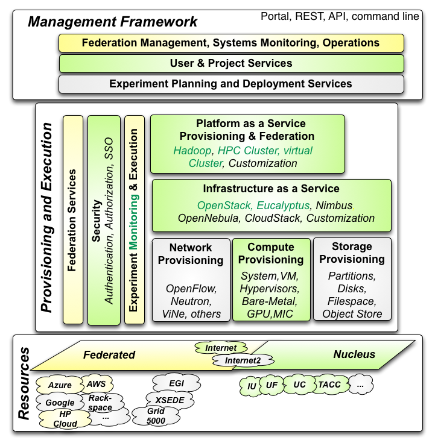
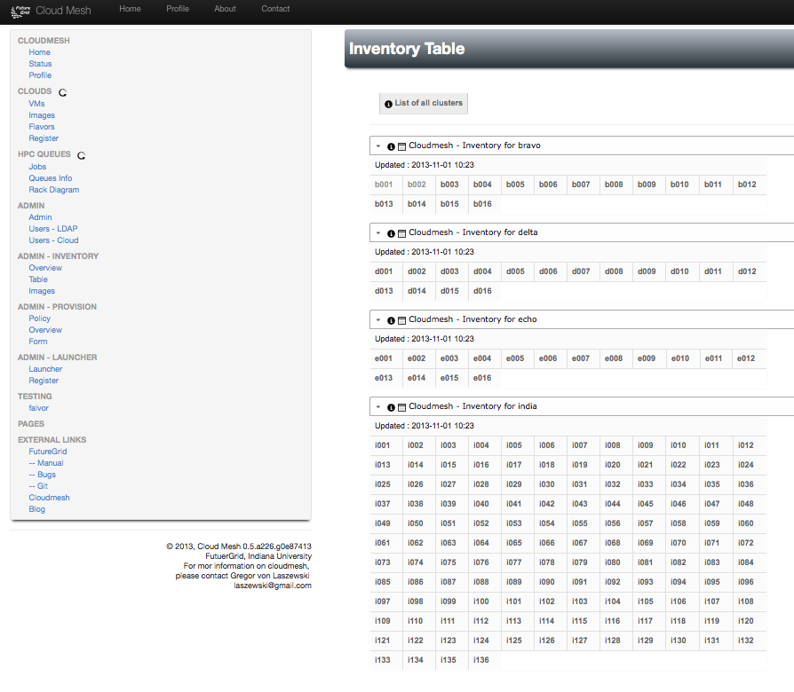

Cloudmesh 1
----------------------------------------------------------------------

At this time we are focussing on Cloudmesh 3 and are not using
Cloudmesh 1 features. However Cloudmesh 1 could still be useful.

.. list-table:: 
   :widths: 30 60 10
   :header-rows: 1

   * - Feature
     - Description
     - Image
   * - Cloudmesh Core
     - A project to interface easily with multiple clouds from the command line and a command shell.
       `github <https://github.com/cloudmesh/cloudmesh>`_,
       `doc <http://cloudmesh.github.io/cloudmesh/>`_
     - |image-registry|
   * - Convenient Command Shell 
     - Cloudmesh contains a nice command shell that goes beyond a
       simple commandline interface. State can be saved between
       command invocations.
     - |image-cmd3|
   * - Cloudmesh Metric for Clouds 
     - Cloudmesh contains a metric report system that id used can
       provide customized reports.
     - |image-metric|
   * - Cloudmesh Inventory
     - Cloudmesh has a simple inventory that allows system
       administrators and users to easily manage resource inventory
       in inventory datatables. The attributes in that table can be
       defined by the user
     - |image-inventory|
   * - Cloudmesh PaaS Launcher
     - Cloudmesh has the ability to interface with various DevOps
       frameworks. Through them we expose via simple command tools the
       ability to conveniently launch platforms. Examples are virtual
       clusters on OpenStack, Apache storm and others. We have an easy
       way to integrate additional platforms into the command shell
       through an automatic code generator for command additions.
     - |image-launcher|
   * - Cloudmesh Federated VMs 
     - Cloudmesh allows the federated management of VMs through one
       interface. This allows us to use CLoudmesh as an onramp
     - |image-manage-vms|
   * - Cloudmesh HPC Batch Processing
     - Cloudmesh includes the ability to view HPC queues. Most
       recently we have added a simple API to also submit jobs. Our
       goal is to be able to manage millions of jobs submitted to a
       Computational Grid, but also user managed heterogeneous sets
       of clusters that may not be port of a national or
       international Grid infrastructure.
     - |image-qinfo| |image-qstat|
   * - Cloudmesh Service Map
     - For locally maintained resources, Cloudmesh provides the
       ability to visualize a service map. We will be expanding upon
       this effort to integrate with our new inventory. This makes it
       possible to for example display services mapped onto compute
       servers, but also concrete sensor information such as
       temperature of the servers
     - |image-service-map| 
		 
		 
 

.. |image-cmd3| image:: _static/cmd3.png
   :width: 100px

.. |image-onramp| image:: _static/Slide1.png
   :width: 100px

.. |image-metric| image:: _static/metric.png
   :width: 100px

.. |image-launcher| image:: _static/launcher.png
   :width: 100px

.. |image-manage-vms| image:: _static/manage_vms.png
   :width: 100px

.. |image-qinfo| image:: _static/qinfo.png
   :width: 100px
.. |image-qstat| image:: _static/qstat.png
   :width: 100px
.. |image-registry| image:: _static/cloud_register_openstack.png
   :width: 100px
.. |image-service-map| image:: _static/service_map.png
   :width: 100px

